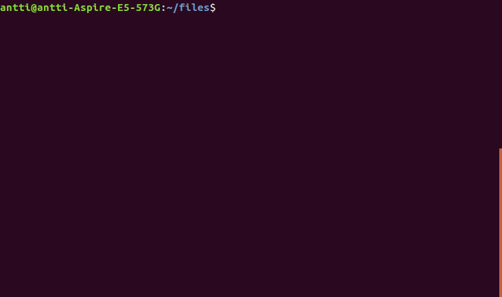

# NAV

Intuitive and interactive way to browse files and folders in bash shell. Implemented with python curses.



#### Features
- Use arrow keys to browse files.
- Modern and easy-to-use search functionality for folders: just start typing the name of the folder and folders are filtered by their name.

## Usage
1. Clone the repository
2. Add following lines to .bashrc:
```bash
export NAV_HOME='path to root of the cloned repository'
alias nav='source $NAV_HOME/bin/nav.sh'
```
3. Refresh .bashrc file with restarting terminal or executing `source .bashrc`
4. Type nav and start browsing files and folders
