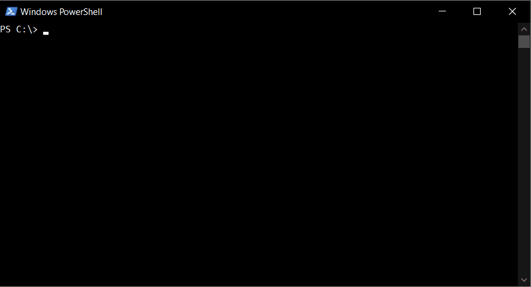

# CDIR

> [!IMPORTANT]  
> This tool is not maintained, and the repo is kept as a read-only archive. Nowadays there are better alternatives such as [yazi](https://yazi-rs.github.io/).

[](https://badge.fury.io/py/cdir)

This project exists because I felt that typing multiple `cd`, `dir`/`ls` commands and striking the tab-key is not very fast or pleasant way to navigate in shell. As developers often need to work in multiple environments, cdir supports bash shell, Windows Command Prompt and PowerShell. The core component of the project is implemented with python and uses curses module. Windows version uses [windows-curses](https://github.com/zephyrproject-rtos/windows-curses) module.



Discussion about cdir in [a Tecmint blog post](https://www.tecmint.com/cdir-navigate-folders-and-files-on-linux):

  *"Yes, fix something that is not broken."* -Linus Torvalds

  *"I agree with you. However, I just decided to try out the tool on CentOS 8 and see how it compares to running the ls and cd commands. Honestly, I like it."* -James Kiarie

   *"Some of the greatness innovations in the world have been realized by fixing the unbroken."* -Pat

See the actual discussion here https://www.tecmint.com/cdir-navigate-folders-and-files-on-linux/comment-page-1/#comment-1336160

#### Features
- Use arrow keys and enter to browse files.
- Modern and easy-to-use search functionality for folders: just start typing the name of the folder and folders are filtered by their name.
- Supports bash shell, Windows Command Prompt and PowerShell.
- Easy to install.

## Usage - Bash
1. Install with `pip install cdir`
2. Add following line to .bashrc:
```bash
alias cdir='source cdir.sh'
```
3. Type cdir and start browsing files and folders.
4. Press f1 to quit cdir.

## Usage - Windows Command Prompt

1. Install with `pip install cdir`
2. Type cdir and start browsing files and folders.
3. Press f1 to quit cdir.

## Contribution

Although there are no formal quidelines for contribution yet, it is warmly welcomed! Please use issues to discuss about changes/features you would like to make before implementing them.
